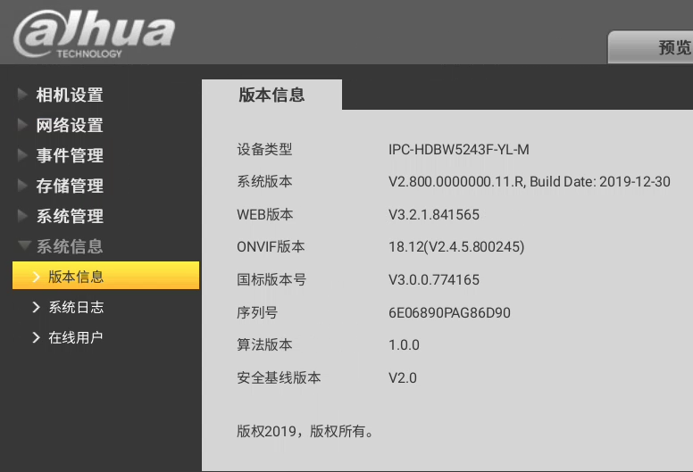

DaHua\_SDK\_Bug
=====
这是大华摄像头SDK传入错误参数导致的未知Bug Demo，Bug 表现为应用中不能存在值为 0 的整型变量，比如 int i = 0, i 会被赋值为 1，int 的包装类 Integer 则不受影响

bug产生位置位于 DaHuaNetUtil 的 isLoginHandlerValid_bug，该方法中调用的大华摄像头SDK方法 QueryRecordState 的第三个参数传入了错误参数 0

**点击下图观看演示视频**(视频中看到的代码不来自于本Demo，主要用于演示效果)：

本Demo需要成功登录大华摄像头才能产生bug，项目中SDK来自[大华官网的SDK：设备网络SDK\\_Android_V3.052.0000002.0.R.201103](https://www.dahuatech.com/service/downloadlists/836.html)，摄像头使用的是

目前该摄像头在大华官网似乎没找到一模一样的型号

